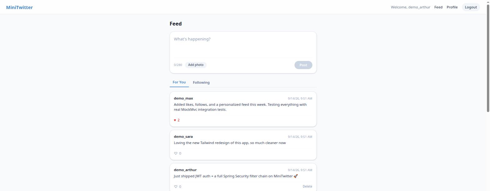
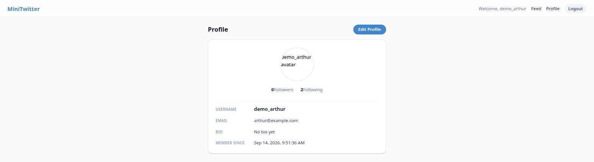
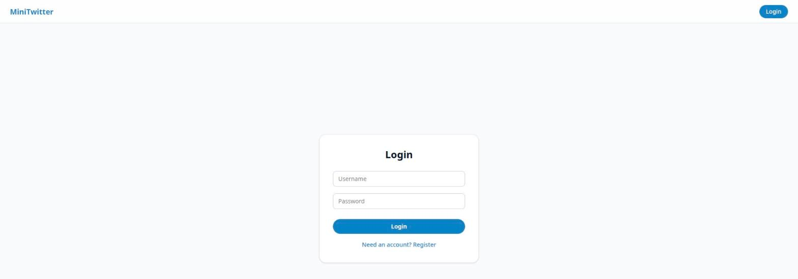

# MiniTwitter

A full-stack Twitter clone built to practice production-shaped engineering, not just CRUD: JWT authentication with a real Spring Security filter chain, a follow graph with a personalized feed, comments, Redis-cached feed reads, Kafka-driven async notifications, optimistic UI updates, a 129-test suite spanning unit, Mockito, and full-stack integration tests, and a documented security/error-handling audit with fixes.

**Backend**: Java 25 · Spring Boot 4.1 · Spring Security · Spring Data JPA · PostgreSQL
**Frontend**: Angular 20 (standalone components) · Tailwind CSS
**Testing**: JUnit 5 · Mockito · MockMvc + H2 · Jasmine/Karma

## Screenshots

| Feed | Profile | Login |
|---|---|---|
|  |  |  |

## What this project demonstrates

- **JWT auth built from the primitives, not a tutorial copy-paste.** A custom `OncePerRequestFilter` populates the `SecurityContext`; `WebSecurityConfig` hand-tunes per-route rules (public feed, public profile lookups, protected writes) — including catching and fixing a real ordering bug where a wildcard route (`/api/users/{username}`) would have accidentally made `/api/users/profile` public too.
- **A real follow graph and personalized feed** (`Follow` entity, `PostRepository.findByAuthorInOrderByCreatedAtDesc`), not just a single global timeline.
- **Found and fixed a live security/correctness audit**, not just written code that happened to work: a catch-all exception handler was silently turning validation errors, malformed JSON, and 404s into generic 500s. Diagnosed with real HTTP requests, fixed with exception-hierarchy-specific handlers, verified with a regression test for every case.
- **129 tests that actually run**, not a token smoke test — see [Testing](#testing) below, including full-stack `MockMvc` integration tests that exercise the real security filter chain and a real (H2) database, and Mockito unit tests for every ownership check, race-safety branch (concurrent double-likes), and access-control edge case.
- **Redis and Kafka each earn exactly one genuine use case, not resume padding.** Redis caches only the impersonal half of the hottest feed page (page 0), with per-viewer like state always computed fresh on top — caching personalized data would have been a correctness bug, not a feature. Kafka decouples notification-writing from the hot like/follow request path via `@TransactionalEventListener(AFTER_COMMIT)`, accepting a documented trade-off (a notification can rarely be lost if Kafka is down at that exact instant) rather than building a persisted outbox this project's scale doesn't justify.
- **Diagnosed a real Spring Boot 4.1.1 platform gap, not just a config typo.** Spring Boot 4.1.1's `spring-boot-autoconfigure` jar ships zero Kafka autoconfiguration classes (verified by inspecting the jar directly) — so `KafkaConfig` wires the producer/consumer factories and listener container by hand instead of relying on a `KafkaTemplate` bean that was never going to exist.
- **Every dependency on Redis/Kafka fails soft, proven by a broker-down test run.** Every Redis call is wrapped in try/catch around `DataAccessException` and degrades to "no cache" (see `FeedCacheServiceTest`); the Kafka producer is tuned to a 1s `max.block.ms` specifically so a broker outage costs a bounded second instead of hanging the request thread for its 60s default — verified live by stopping the broker mid-session and confirming create/like/follow/notifications all still return 200.
- **Optimistic UI with rollback**: liking a post updates the UI instantly and reverts cleanly if the request fails — covered by a dedicated frontend test.
- **A deliberate database-level cascade** (`@OnDelete(CASCADE)`) so deleting a post, user, or comment cleans up its dependents without extra service code.

## Features

- User registration, JWT login, profile view/edit, avatar upload
- Create posts (text + optional image), delete your own posts
- Like/unlike posts with live counts, comment on posts
- Follow/unfollow users; a "For You" (global) and "Following" (personalized) feed
- Public profile pages per user, with follower/following counts
- Async notifications (like/follow) delivered via Kafka, with an unread badge in the header
- Redis-cached feed reads (page 0, ~30s TTL), transparent to the client either way

## Quick Start

```bash
git clone https://github.com/naosh1ma/MiniTwitter.git
cd MiniTwitter

# 1. Database
docker-compose up -d postgres

# 2. Backend  (http://localhost:8080)
./mvnw spring-boot:run

# 3. Frontend (http://localhost:4200)
cd minitwitter-frontend && npm install && npm start
```

Requires Java 25+, Node 20.19+/22+, and Docker/Podman for Postgres. `docker-compose.yml` also defines a full containerized stack (`docker-compose up -d`) if you'd rather not run things locally — see [Docker Services](#docker-services).

## Testing

```bash
./mvnw test                                    # 67 backend tests
cd minitwitter-frontend && npx ng test          # 62 frontend tests
```

| Suite | Count | What it covers |
|---|---|---|
| `JwtServiceTest` | 7 | Token generation/parsing, tampering detection |
| `PostServiceTest` / `UserServiceTest` | 22 | Mockito unit tests: ownership checks, like-toggle race safety, follow/self-follow rules, anonymous-vs-authenticated behavior, feed cache hit/miss/eviction, like/follow event publishing |
| `CommentServiceTest` / `NotificationServiceTest` | 11 | Ownership checks, chronological ordering, unread counts, mark-as-read authorization |
| `FeedCacheServiceTest` / `NotificationConsumerTest` | 9 | Redis fail-soft behavior on a down broker; Kafka consumer idempotency (duplicate `eventId`) and unknown-user skip |
| `PostFlowIntegrationTest` | 17 | Full HTTP stack via MockMvc — real security filter chain, real exception handling, real (H2) database. Register → login → post → like → follow → comment → delete, plus every error path |
| Frontend component/service specs | 62 | `HttpTestingController`-driven: feed loading, tab switching, optimistic like/rollback, comments, notifications, delete, auth flows — no live network calls |

None of the above needs Redis or Kafka running — CI (and this test run) exercises every fail-soft path against a broker/cache that's simply absent, which is the actual proof the resilience code works.

No mocked-away business logic in the integration tests — a request to `/api/posts` with no token gets rejected by the *actual* `JwtAuthenticationFilter`, not a stand-in.

## Architecture

```
Angular SPA → Controller (@RestController) → Service (@Transactional) → Spring Data JPA → PostgreSQL
                     ↑
     WebSecurityFilterChain + JwtAuthenticationFilter (every request)
                     ↓
              GlobalExceptionHandler (every thrown exception)
```

```
src/main/java/org/art/mt/
├── config/       WebSecurityConfig, JwtAuthenticationFilter, CORS, static file serving
├── controller/    Thin — HTTP ↔ service translation only
├── service/       Business logic, @Transactional boundaries
├── repository/    Spring Data JPA interfaces
├── entity/        User, Post, Like, Follow, Comment, Notification
├── event/         Internal Spring events (PostLikedEvent, UserFollowedEvent) bridged to Kafka
├── consumer/      NotificationConsumer (@KafkaListener)
├── dto/           Request/response shapes
└── exception/     GlobalExceptionHandler + typed exceptions
```

## API Reference

| Method | Endpoint | Auth |
|---|---|---|
| `POST` | `/api/auth/login` | — |
| `POST` | `/api/users/register` | — |
| `GET` | `/api/users/{username}` | — |
| `GET` `PUT` | `/api/users/profile` | ✓ |
| `POST` | `/api/users/profile/avatar` | ✓ |
| `POST` `DELETE` | `/api/users/{username}/follow` | ✓ |
| `GET` | `/api/posts/feed` | — |
| `GET` | `/api/posts/feed/following` | ✓ |
| `POST` | `/api/posts` | ✓ |
| `DELETE` | `/api/posts/{id}` | ✓ (owner only) |
| `POST` | `/api/posts/{id}/like` | ✓ |
| `POST` | `/api/posts/{id}/image` | ✓ (owner only) |
| `GET` `POST` | `/api/posts/{id}/comments` | GET — ; POST ✓ |
| `DELETE` | `/api/posts/{id}/comments/{commentId}` | ✓ (owner only) |
| `GET` | `/api/notifications` | ✓ |
| `GET` | `/api/notifications/unread-count` | ✓ |
| `POST` | `/api/notifications/{id}/read` | ✓ (owner only) |

## Docker Services

`docker-compose.yml` defines the full stack:

| Service | Port | Notes |
|---|---|---|
| frontend | 4200 | Angular via Nginx |
| backend | 8080 | Spring Boot API |
| postgres | 5433 | Database |
| redis | 6379 | Caches the feed's hottest page (~30s TTL); app runs fine if this is down |
| kafka | 9092 | Carries like/follow notification events to `NotificationConsumer`; app runs fine if this is down |
| prometheus / grafana | 9090 / 3000 | Metrics |
| elasticsearch / logstash / kibana | 9200 / 5044 / 5601 | Logging |

## Honest Roadmap

This is a learning/portfolio project and the README says so on purpose — a list of known gaps is more credible than pretending there are none:
- ~~Comments on posts~~ — done, with cascade-delete and full test coverage
- ~~Redis caching and Kafka event streaming are provisioned but not wired into the app~~ — both now do real work (feed caching, async notifications); see above for the "one genuine use case each" reasoning
- GitHub Actions CI workflow exists (`.github/workflows/ci.yml`, backend + frontend jobs) but hasn't been pushed and confirmed green yet — the status badge goes here once it has
- Deployment: `docker-compose.prod.yml` + `Caddyfile` exist (KRaft-mode Kafka, TLS via Caddy, secrets out of `application.properties`) but are reviewed, not yet run against a real VPS — Kafka/Redis being load-bearing now means the target box needs to be sized accordingly (~4GB, not the 1-2GB a static-content app could get away with). One known gap before a real deploy: `ApiService` still hardcodes `http://localhost:8080/api` as its base URL, which would need to become environment-configurable (or relative, since Caddy proxies same-origin) for the built frontend to actually reach the backend in production.

## License

MIT — see [LICENSE](LICENSE).

## Author

**Arthur** — [@naosh1ma](https://github.com/naosh1ma)
